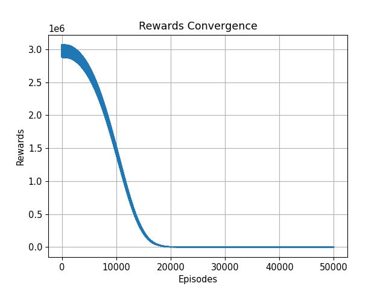

## 安装
### 创建环境
``` Bash
conda create -n env_name python=3.9
conda activate env_name
pip install -r requirements.txt
conda install pytorch torchvision torchaudio cudatoolkit=11.1 -c pytorch -c nvidia
```

## 运行 
请执行 RadarDetection/scripts/main.py \
训练时请调整参数Train为True \
模型存储于 RadarDetection/results/TargetDetecter/RadarDetection/MSSFNet

## 运行 
训练和运行的更多参数请见config文件

